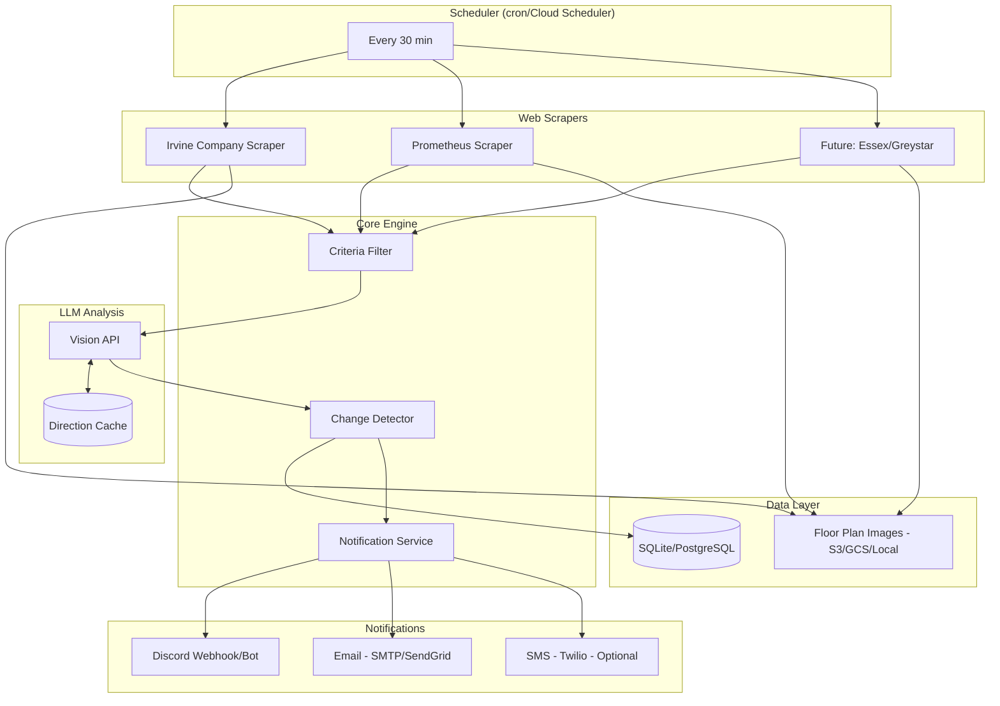
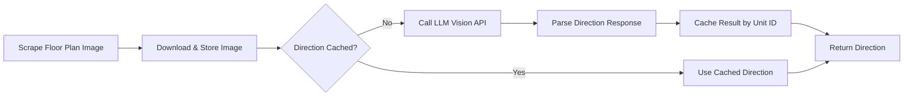
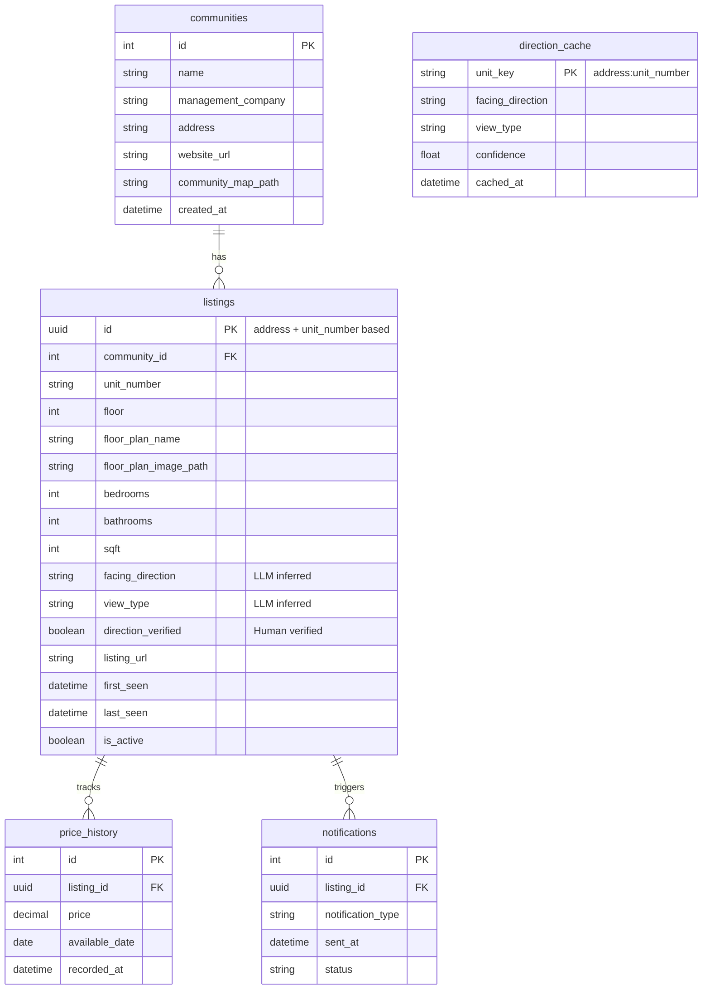

# Apartment Availability Tracker - Design Document

A personal project to monitor apartment availability across multiple property management companies and receive notifications when listings match specific criteria.

---

## Requirements Summary

### Housing Criteria (Filtering Rules)

| Criteria | Value | Type |
|----------|-------|------|
| Floor | ≥ 2 (not first floor) | **Required** |
| Square footage | ≥ 680 sq ft | **Required** |
| Layout (minimum) | 1B1B | **Required** |
| Price ceiling | ≤ $4,699/month | **Required** |
| Bedroom windows | Face South or Southwest | **Preferred** ⭐ Highest |
| Layout (ideal) | 2B2B | Preferred |
| Square footage (ideal) | ≥ 850 sq ft | Preferred |
| Higher floors | Preferred over lower floors | Preferred |
| View | Not facing another building (or top floor) | Preferred |

### Target Communities (Ordered by Priority)

| Priority | Community | Management | URL |
|----------|-----------|------------|-----|
| 🔥 **1** | Santa Clara Square | Irvine Company | [availability](https://www.irvinecompanyapartments.com/locations/northern-california/santa-clara/santa-clara-square/availability.html) |
| 2 | 100 Moffett | Prometheus | [link](https://prometheusapartments.com/ca/mountain-view-apartments/100-moffett) |
| 3 | The Dean | Prometheus | [link](https://prometheusapartments.com/ca/mountain-view-apartments/the-dean) |
| 4 | The Tillery | Prometheus | [link](https://prometheusapartments.com/ca/mountain-view-apartments/the-tillery) |
| 5 | The Hadley | Prometheus | [link](https://prometheusapartments.com/ca/mountain-view-apartments/the-hadley) |
| 6 | Montrose | Prometheus | [link](https://prometheusapartments.com/ca/mountain-view-apartments/montrose) |
| 7 | Hearth | Prometheus | [link](https://prometheusapartments.com/ca/santa-clara-apartments/hearth) |

---

## Proposed Tech Stack

### Language: **Python 3.11+**

**Rationale:**
- Excellent libraries for web scraping (`playwright`)
- Strong notification ecosystem (`discord.py`, `smtplib`, `twilio`)
- Good database options (`sqlalchemy`, `sqlite`, `postgresql`)
- Easy LLM API integration (OpenAI, Gemini, Claude)
- Simple, readable code for personal project maintenance

### Architecture Diagram



---

## Component Details

### 1. Web Scrapers

#### Why Playwright over Selenium?

| Aspect | Playwright | Selenium |
|--------|------------|----------|
| **Setup** | Single `pip install`, auto-downloads browsers | Requires separate WebDriver binaries |
| **Speed** | Faster execution, built-in auto-wait | Manual waits needed |
| **Async** | Native async/await support | Primarily synchronous |
| **Reliability** | Better auto-waiting, fewer flaky tests | More manual synchronization |
| **Modern** | Designed for modern SPAs | Designed for older web apps |
| **API** | Cleaner, more intuitive API | More verbose |

**Playwright** is the modern choice for scraping JavaScript-heavy apartment websites. It automatically waits for elements to be ready, handles dynamic content natively, and requires minimal configuration.

```python
# Example: Playwright simplicity
from playwright.async_api import async_playwright

async with async_playwright() as p:
    browser = await p.chromium.launch(headless=True)
    page = await browser.new_page()
    await page.goto(url)
    # Auto-waits for element to be visible
    await page.click("button#show-availability")
    listings = await page.query_selector_all(".listing-card")
```

#### Project Structure
```
scrapers/
├── base.py              # Abstract base scraper class
├── irvine.py            # Irvine Company scraper (Priority 1)
├── prometheus.py        # Prometheus apartments scraper
└── registry.py          # Scraper registry for easy extension
```

> [!NOTE]
> **"Prometheus scraper"** refers to the web scraper for **Prometheus Apartments** (a real estate company), not the Prometheus monitoring tool.

#### Data Extracted Per Listing

| Field | Description | Extraction |
|-------|-------------|------------|
| `id` | SHA256 hash of `address:unit_number` (first 16 chars) | Generated |
| `community_name` | Apartment complex name | ✅ Scraped |
| `address` | Full street address | ✅ Scraped |
| `unit_number` | Unit identifier (e.g., "Unit 305") | ✅ Scraped |
| `price` | Monthly rent | ✅ Scraped |
| `bedrooms` | Number of bedrooms | ✅ Scraped |
| `bathrooms` | Number of bathrooms | ✅ Scraped |
| `sqft` | Square footage | ✅ Scraped |
| `floor` | Floor number | ⚠️ Sometimes scraped |
| `floor_plan_name` | Floor plan type/name | ✅ Scraped |
| `floor_plan_image_url` | URL to floor plan image | ✅ Scraped |
| `available_date` | Move-in date | ✅ Scraped |
| `facing_direction` | Window orientation (S, SW, etc.) | 🤖 LLM inferred |
| `view_type` | Courtyard/street/building/unknown | 🤖 LLM inferred |
| `listing_url` | Direct link to unit | ✅ Scraped |

---

### 2. LLM-Based Direction Detection

Since no apartment website lists window orientation, we use **computer vision** with an LLM (Gemini, GPT-4V, or Claude) to analyze:
1. **Floor plan image** - Room layout and window positions
2. **Community map screenshot** - Unit location on property
3. **Compass orientation** - From community map/Google Maps



**Key Features:**
- **Caching**: Direction is cached per unit (address + unit number) to avoid redundant API calls
- **Human Verification Flag**: Results marked for optional manual verification
- **Bundled Analysis**: Single LLM call extracts both `facing_direction` and `view_type`
- **Unknown Fallback**: Units that can't be determined are marked as "unknown"

**Example LLM Prompt:**
```
Analyze these images of an apartment unit:
1. Floor plan showing room layout
2. Community map showing unit location
3. Compass orientation from the community

Determine:
1. Which cardinal direction (N, NE, E, SE, S, SW, W, NW) do the bedroom windows face?
2. What is the view type? (courtyard, street, building, other, unknown)

Respond in JSON format:
{"facing_direction": "SW", "view_type": "courtyard", "confidence": "high"}
```

---

### 3. Floor Plan Image Storage

Since floor plans are images (not text), we need a storage strategy:

| Option | Pros | Cons |
|--------|------|------|
| **Local filesystem** | Simple, free, fast | Lost if machine dies, not cloud-accessible |
| **AWS S3** | Durable, cheap ($0.023/GB), scalable | Requires AWS setup |
| **Google Cloud Storage** | Free credits available, durable | Requires GCP setup |

**Recommended**: Start with **local storage**, migrate to S3/GCS when deploying to cloud.

```
data/
├── floor_plans/
│   ├── santa-clara-square/
│   │   ├── unit-305-floorplan.png
│   │   └── unit-410-floorplan.png
│   └── the-dean/
│       └── ...
└── community_maps/
    ├── santa-clara-square-map.png
    └── ...
```

---

### 4. Database Schema



---

### 5. Criteria Filtering Engine

```yaml
filters:
  required:
    floor: ">= 2"
    sqft: ">= 680"
    bedrooms: ">= 1"
    bathrooms: ">= 1"
    price: "<= 4699"
  
  preferred:
    facing_direction: ["S", "SW"]  # ⭐ Highest priority
    bedrooms: ">= 2"
    bathrooms: ">= 2"
    sqft: ">= 850"
    floor: "max"
    view_type: ["!building", "top_floor"]
  
  scoring:
    # South-facing is MOST important
    facing_south_sw: 15
    # Other preferences
    sqft_850_plus: 5
    bedroom_2b2b: 4
    high_floor: 3      # Per floor above 2nd
    no_building_view: 4
```

**Notification Logic:**
```
Alert if: (passes ALL required filters) AND (facing_direction is S or SW)
```

> For the initial version, we alert on any listing that passes hard filters AND faces South/Southwest. Scoring system can be added later for ranking.

---

### 6. Notification System

#### Discord (Primary) 🎯

**Options:**
1. **Webhook** - Simplest, post to a channel (recommended to start)
2. **Bot with threads** - Create a thread per listing for discussion

```python
# Discord webhook example
import httpx

webhook_url = "https://discord.com/api/webhooks/..."
embed = {
    "title": "🏠 New Match: Santa Clara Square - $3,850/mo",
    "color": 0x00ff00,
    "fields": [
        {"name": "📍 Address", "value": "4050 Central Expy, Unit 305"},
        {"name": "💰 Price", "value": "$3,850/month", "inline": True},
        {"name": "📐 Size", "value": "890 sqft", "inline": True},
        {"name": "🛏️ Layout", "value": "1B1B", "inline": True},
        {"name": "🧭 Direction", "value": "Southwest ✅", "inline": True},
        {"name": "🏢 Floor", "value": "3rd", "inline": True},
        {"name": "📅 Available", "value": "Dec 15, 2024", "inline": True},
    ],
    "url": "https://irvinecompanyapartments.com/..."
}
httpx.post(webhook_url, json={"embeds": [embed]})
```

#### Email (Secondary)

**With Aggregation Option:**
- If rate-limited or prefer digest mode, aggregate notifications
- Send digest every 6 hours (configurable)
- Empty digest = no email sent

```yaml
notifications:
  email:
    enabled: true
    mode: immediate  # or "digest"
    digest_interval_hours: 6
```

#### SMS (Optional - Low Priority)

**Twilio pricing**: ~$0.0079/message (cheap enough for occasional alerts)
- Only implement if Discord/email isn't sufficient
- Could be a stretch goal

---

### 7. Deployment

#### Local Development
- Test locally with cron or manual runs
- SQLite database
- Local filesystem for images

#### Cloud Deployment: GCP Free Tier (Recommended)

**GCP Always Free Tier Limits:**
- **Compute**: 1x e2-micro VM (perpetual free in us-west1, us-central1, us-east1)
- **Storage**: 30 GB persistent disk + 5 GB Cloud Storage
- **Egress**: 1 GB/month to most regions

**Database Strategy:**
- **SQLite on e2-micro** - Perfect for this project
  - Zero overhead (just a file)
  - No separate process
  - Runs fine on 1GB RAM
  - Daily backup to Cloud Storage (5GB free)

> [!TIP]
> SQLite is ideal for single-user applications like this tracker. No need for PostgreSQL unless you add multi-user UI later.

#### Kubernetes with Helm (Optional)

> [!NOTE]
> Helm is more complex than Docker Compose but provides better production deployment patterns. If you want Helm, here's the comparison:

| Aspect | Docker Compose | Helm |
|--------|----------------|------|
| **Learning curve** | Simple | Moderate |
| **Local dev** | ✅ Ideal | Requires minikube/kind |
| **Production** | Swarm or manual | ✅ Ideal for K8s |
| **Scaling** | Limited | ✅ Full K8s features |
| **Config management** | Environment files | Values files, secrets |

**Recommendation**: Start with Docker Compose locally, add Helm charts when deploying to Kubernetes (GKE, EKS). Both can coexist.

```
deployment/
├── docker-compose.yml    # Local development
├── Dockerfile
└── helm/
    └── apartment-tracker/
        ├── Chart.yaml
        ├── values.yaml
        └── templates/
            ├── deployment.yaml
            ├── cronjob.yaml
            └── secrets.yaml
```

---

## Project Structure

```
apartment_tracker/
├── src/apartment_tracker/
│   ├── __init__.py
│   ├── main.py                  # Entry point / CLI
│   ├── config.py                # Configuration loading
│   ├── scrapers/
│   │   ├── base.py              # Abstract scraper
│   │   ├── irvine.py            # Irvine Company (Priority 1)
│   │   ├── prometheus.py        # Prometheus Apartments
│   │   └── registry.py
│   ├── models/
│   │   ├── database.py          # SQLAlchemy models
│   │   └── schemas.py           # Pydantic schemas
│   ├── analysis/
│   │   ├── llm_client.py        # LLM API wrapper
│   │   ├── direction.py         # Direction detection logic
│   │   └── cache.py             # Direction caching
│   ├── filters/
│   │   └── criteria.py          # Filtering logic
│   ├── notifications/
│   │   ├── discord.py           # Discord webhook/bot
│   │   ├── email.py             # Email with aggregation
│   │   └── aggregator.py        # Digest logic
│   └── storage/
│       └── images.py            # Floor plan storage
├── tests/
├── config/
│   ├── config.yaml
│   ├── communities.yaml
│   └── criteria.yaml
├── data/
│   ├── apartment_tracker.db
│   └── floor_plans/
├── deployment/
│   ├── docker-compose.yml
│   ├── Dockerfile
│   └── helm/
└── pyproject.toml
```

---

## Implementation Phases

### Phase 1: Core Scraping (Week 1-2)
- [ ] Project setup (Poetry, structure, config)
- [ ] Playwright base scraper class
- [ ] **Irvine Company scraper** (Santa Clara Square - highest priority)
- [ ] SQLite database + models
- [ ] Basic CLI runner
- [ ] Floor plan image download/storage

### Phase 2: LLM Integration (Week 2-3)
- [ ] LLM client (Gemini/GPT-4V)
- [ ] Direction detection from floor plan + map
- [ ] Direction caching by unit
- [ ] View type inference

### Phase 3: Filtering & Notifications (Week 3-4)
- [ ] Criteria filtering engine
- [ ] Discord webhook notifications
- [ ] Email notifications with digest option
- [ ] Change detection (new listings, price changes)

### Phase 4: Prometheus & More (Week 4-5)
- [ ] Prometheus scraper (6 communities)
- [ ] Error handling & retries
- [ ] Logging & monitoring
- [ ] Docker containerization

### Phase 5: Cloud Deployment (Week 5-6)
- [ ] Helm charts (optional)
- [ ] Deploy to GCP/AWS free tier
- [ ] Scheduler setup (cron/Cloud Scheduler)
- [ ] CI/CD pipeline

### Phase 6: UI Dashboard (Stretch)
- [ ] FastAPI backend
- [ ] Next.js frontend
- [ ] Price history visualization

---

## Verification Plan

### Automated Tests
```bash
pytest tests/ -v --cov=apartment_tracker
```

### Manual Verification
1. **Scraper**: Compare 5 listings with actual website
2. **LLM direction**: Verify 10 direction inferences manually
3. **Discord**: Send test notification to test channel
4. **Email**: Verify formatting in inbox
5. **Filters**: Test with known good/bad listings

---

## Open Questions (Resolved)

| Question | Answer |
|----------|--------|
| Notification method | Discord (primary) + Email (with digest option) |
| Hosting | Local testing → GCP/AWS free tier |
| Target communities | 7 URLs provided (Irvine Company highest priority) |
| Direction detection | LLM vision + caching |
